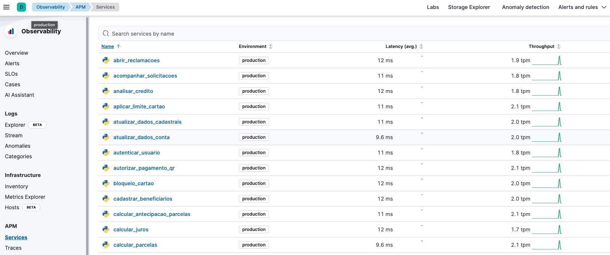

# apm-bank-lab

This project is a simple way to simulate a big container infra with APM using bank services. ⚠️ _This isn't a full bank app!_

1. Clone de project
2. Edit the `app.py` file and set the value of **SECRET_TOKEN** and **SERVER_URL** with your environment values.
3. Create the image ( `docker build -t default_apm_app .` )
4. Run the docker compose ( `docker compose up` )

The result will be somethin like that:

